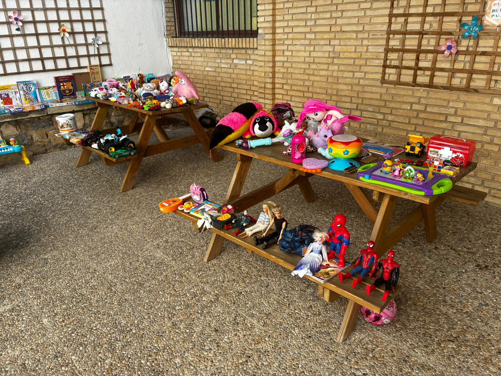
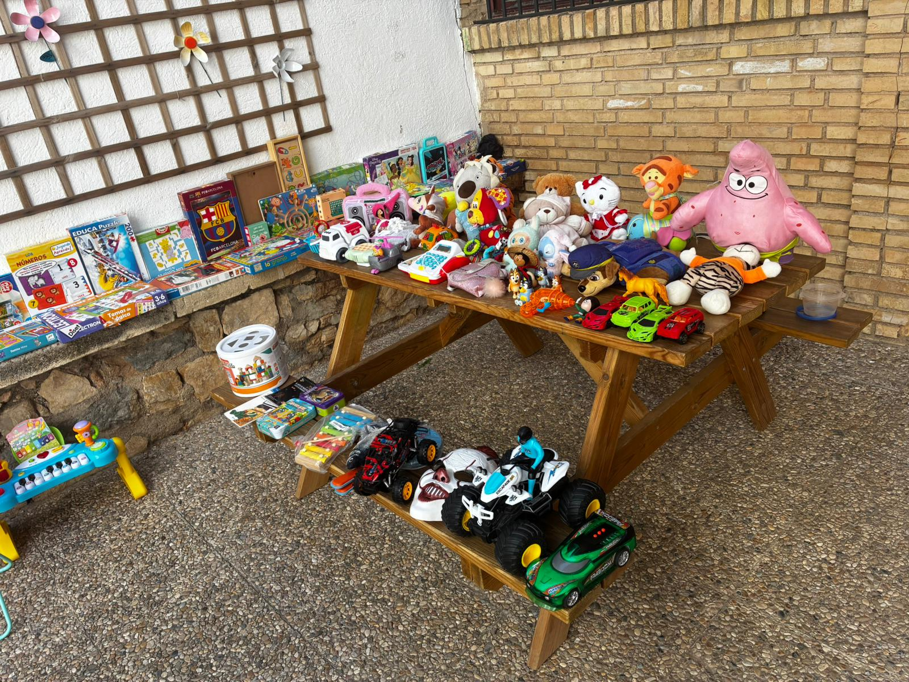

Iniciativa de economía circular del AMPA: los juguetes que ya no usas en casa pueden hacer feliz a otra familia, y viceversa.

## Cómo funcionó

- Cada peque traía **uno o varios juguetes** en buen estado para dejar en el mercadillo.
- Con **2 € (mínimo)**, podía llevarse otro juguete del mercadillo.
- El dinero recaudado se destinó íntegramente al AMPA para **sufragar las actividades** que organizamos durante el curso.

## La actividad

El mercadillo se celebró en horario de **mañana** y fue un **éxito de participación** entre el alumnado: los peques disfrutaron de una jornada de intercambio y de dar una segunda vida a sus juguetes.

Gracias a todas las niñas y niños que participasteis. ¡Juntos hacemos del cole un lugar genial!
