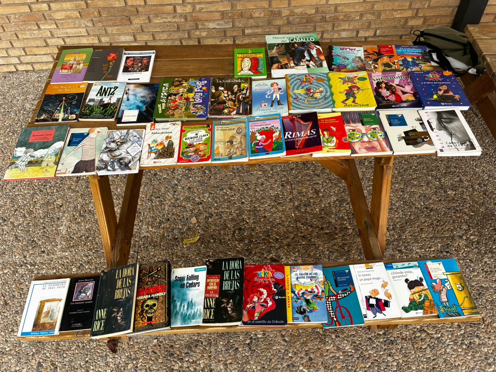
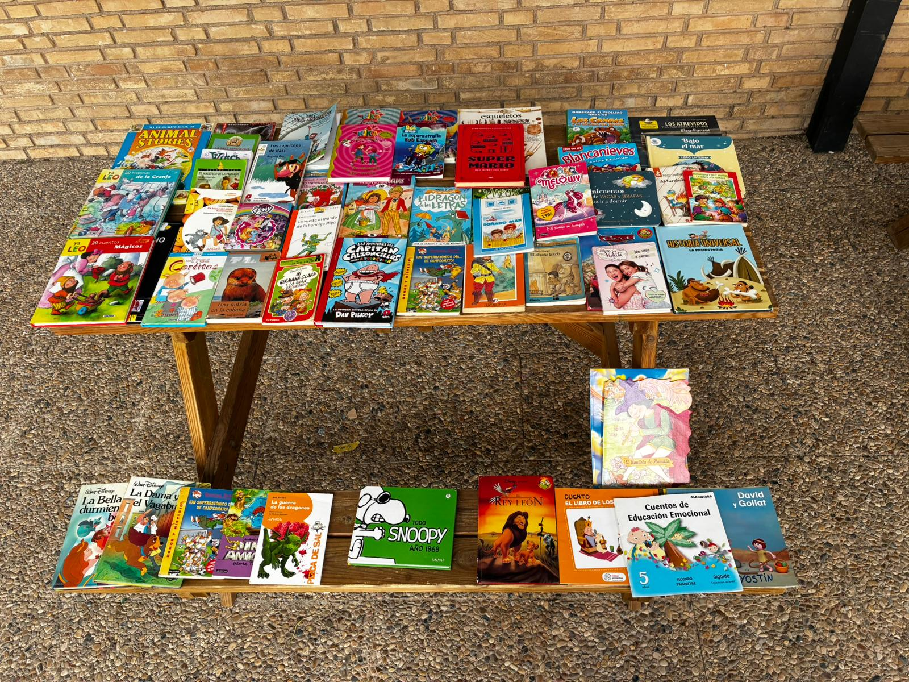

Iniciativa del AMPA para fomentar la lectura y la reutilización: los libros que ya no usas pueden hacer feliz a otra familia.

## Cómo funcionó

- Cada peque podía traer libros en buen estado.
- A cambio, podía llevarse otro libro del mercadillo.
- La actividad se centró en el alumnado de **4º, 5º y 6º de primaria**.

## La actividad

Por la buena acogida y demanda, hemos decidido **repetir el mercadillo del libro** en futuras ediciones.

Gracias a todas las familias que participasteis. ¡Juntos hacemos del cole un lugar genial!
